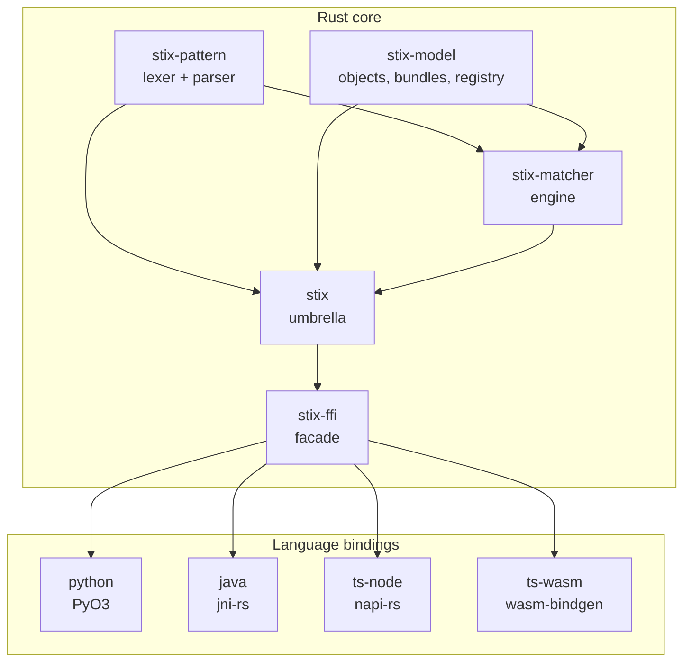
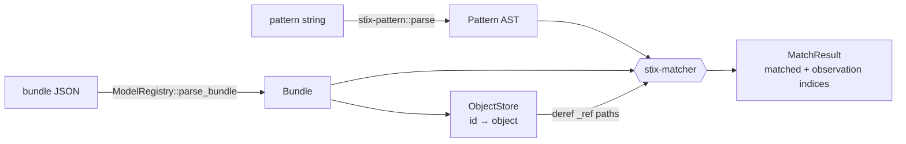

# Architecture

## Crate graph

Five focused crates with acyclic edges; each lower crate is usable standalone.
Four bindings wrap one shared FFI facade:

## Data flow

Custom-type hooks run inside `parse_bundle` (once per object, synchronously); their
output is stored as data, so nothing re-enters host-language code during matching.

## One match, step by step

Pattern: `[network-traffic:src_ref.value = '198.51.100.5']` against a bundle
containing an `ipv4-addr`, a `network-traffic` whose `src_ref` points at it, and an
`observed-data` referencing both.

1. **Observations.** `match_bundle` finds the `observed-data` SDO → one observation
   containing the two SCOs, and builds an `ObjectStore` over the bundle.
2. **Candidates.** The expression references one type, `network-traffic`; the
   observation has one candidate → one binding to try.
3. **Path resolution.** `src_ref` resolves on the bound object to the string
   `"ipv4-addr--a1"`; because the path continues (`.value`), the matcher treats it
   as an id, dereferences it through the store, and reads `value` off the
   `ipv4-addr` → `"198.51.100.5"`.
4. **Operator.** `=` compares the resolved value with the literal → true.
5. **Result.** The observation satisfies the block → `MatchResult` with
   `matched = true` and that observation's index.

## The FFI facade

`stix-ffi` is a pure-Rust crate (no FFI macros) that every binding wraps: an
`Engine` handle owning the registry, opaque `Pattern`/`Bundle` handles, a plain
`MatchOutcome`, and a flat `FfiError { code, message }` each language maps onto its
own exception hierarchy. Deep structure crosses as JSON; each binding converts it to
native objects at its edge. This keeps all four bindings thin and behaviorally
identical.

## How the repo is run

The repository is organized into agent-owned areas (core, one per binding) with an
ownership map and issue workflow in
[`AGENTS.md`](https://github.com/benjamin-small/stix-rust/blob/main/AGENTS.md);
design specs and implementation plans live under `docs/superpowers/`.
