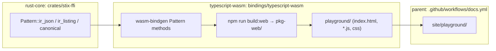

# Pattern playground — design

**Date:** 2026-09-26
**Status:** Approved in chat; pending spec review

## Goal

A static web page, published on the project's GitHub Pages site, where a user
types a STIX pattern and immediately sees what this crate makes of it: the parse
error (if any), the AST, the IR (as a listing, as JSON, and as a graph), and the
canonical text rendered back from the IR. Everything runs client-side in
WebAssembly compiled from the Rust core; there is no server.

## Non-goals

- Matching patterns against bundles (no bundle input pane).
- Editing or executing IR by hand.
- A framework, bundler, or new `package.json` for the page.
- New IR APIs in `stix-pattern` (e.g. `to_mermaid`). The graph is built in the
  page from the IR JSON.
- PR-time CI for the wasm binding. `ci.yml` does not run the wasm tests today;
  closing that gap is a separate issue.

## Architecture



The work splits into three PRs along area boundaries (see `AGENTS.md`). Each
depends on the one before it.

### PR 1 — `rust-core`: expose the IR through `stix-ffi`

Add three methods to `stix_ffi::Pattern` in `crates/stix-ffi/src/handles.rs`,
next to the existing `to_json`:

| Method | Returns | Built from |
| --- | --- | --- |
| `ir_json(&self) -> String` | The lowered `Program` as compact JSON | `serde_json::to_string(&ir::lower(ast))`, same `"null"` fallback as `to_json` |
| `ir_listing(&self) -> String` | The human-readable listing | `ir::lower(ast).to_listing()` |
| `canonical(&self) -> String` | Canonical pattern text | `ir::render(&ir::lower(ast))` |

All three are infallible: a `Pattern` handle only exists for a successfully
parsed AST, and `lower` always produces a valid program. Each call lowers
afresh; patterns are small and the playground calls each once per edit, so no
caching.

The IR is already reachable as `stix::pattern::ir`, because the umbrella crate
re-exports `stix_pattern` in full. No re-export changes are needed.

**Tests:** unit tests in `stix-ffi` asserting, for
`[file:size > 1024] OR [file:name = 'a']`: `ir_json` parses as JSON, with
`schema_version` 1, a `blocks` array of two comparison blocks, and a separate
`main` block; `ir_listing` contains `block main (observation):`; `canonical`
of the unspaced source `[file:size>1024]  OR [file:name='a']` equals
`[file:size > 1024] OR [file:name = 'a']`.

Other bindings do not have to expose these methods. They can adopt them later.

### PR 2 — `typescript-wasm`: bindings + the playground page

**Binding surface** (`bindings/typescript-wasm/src/lib.rs` and `ts/index.ts`):
add three getters on `Pattern`, mirroring the existing `ast` getter: `ir`
(the parsed IR as a JS object), `irListing` (string), and `canonical` (string). Add them to
the existing vitest suite in `tests/stix.test.ts`.

**Page layout** (`bindings/typescript-wasm/playground/`):

```
playground/
  index.html      markup and layout
  playground.css  styles (light/dark via prefers-color-scheme)
  main.js         loads the wasm, wires input → panes
  graph.js        pure: IR JSON → Mermaid flowchart text
  spans.js        pure: UTF-8 byte offsets → JS string (UTF-16) indices
  examples.js     the example patterns
```

The page is plain ES modules and does not import the TypeScript wrapper in
`ts/`. `main.js` imports the `wasm-pack --target web` output directly from a
sibling `pkg/` directory and calls its default `init()`. Mermaid is loaded from a
sibling `mermaid.min.js`. The build step below supplies both files. They are not
committed.

**UI:**

- Left: a monospace `<textarea>` for the pattern and an examples `<select>`.
  Its first entry loads on page load.
- Right: tabs **Graph · IR listing · AST · IR JSON · Canonical**. The last tab
  you picked is remembered in `localStorage`, wrapped in try/catch.
- Input is re-parsed 150 ms after the last keystroke.
- **On a parse error:** a red banner shows the message and the offending range
  is underlined in the input. The range comes from the stable `Display` format
  `parse error at bytes {start}..{end}: {message}`, parsed with a regex, then
  converted with `spans.js`. The tabs keep the last successful output, dimmed,
  so the view doesn't flicker while you type.
- **Span highlighting:** hovering an instruction node in the graph highlights
  that instruction's `span` in the input. So does hovering a line in the IR
  listing, since listing lines map to instructions in listing order. Instructions
  with no span highlight nothing.

**Examples** (`examples.js`) include at least: a single comparison; `AND`/`OR`
inside one observation; `EXISTS`; `IN (...)`; `NOT` with an operator; two
observations joined by `FOLLOWEDBY ... WITHIN 300 SECONDS`; `REPEATS`; and
`START ... STOP`.

**Graph** (`graph.js`, `irToMermaid(program) → string`):

- `flowchart TB`. Each block is a `subgraph`, labelled `block N (comparison)` or
  `main`.
- Each instruction is a node labelled with its line from the IR listing,
  with the alignment padding removed, for example `t1 = gt t0, 1024` or
  `yield t1`. Reusing the listing keeps literal and path formatting in Rust.
  The listing's instruction lines are in the same order as the program's
  instructions (comparison blocks, then `main`). `irToMermaid(program, listing)`
  throws if the two counts differ.
  Load/compare nodes, boolean nodes (`and`/`or`) and terminators (`yield`/`ret`)
  each get a distinct Mermaid class.
- Edges run from each operand (`lhs`, `rhs`, `input`, `value`) to its consumer.
  Each `observe` node gets a dashed edge from the `yield` node of the block it
  evaluates, drawn in the direction the value flows.
- Node ids are `i<InstrId>`. Every string placed in a label is escaped for
  Mermaid: quotes, brackets, `#`, and `<`/`>` become entity codes.
- Mermaid runs with `securityLevel: 'strict'` and renders into a container. On a
  render failure the pane shows the error text instead of a blank area.

**Build** (`package.json`): add
`"build:playground": "npm run build:web && node scripts/build-playground.mjs"`.
The script copies `playground/*`, `pkg-web/*` (as `pkg/`), and
`../../docs/book/mermaid.min.js` into `playground-dist/`. It only reads the
Mermaid file, which stays owned by the book. Add `playground-dist/` and
`pkg-web/` to the binding's `.gitignore`.

**Tests** (vitest):

- `graph.js`: the output for every example pattern (IR from the Node build) has
  one `subgraph` per block, one node per instruction, and a dashed edge per
  `observe`. Listing-line parsing handles negated mnemonics, terminators, and
  string literals containing runs of spaces. Label escaping is tested on a string literal containing
  `"`, `]`, `#` and `<`.
- `spans.js`: byte→UTF-16 conversion for ASCII and for a multi-byte string.
- The parse-error message regex matches the `Display` output of a real
  `parsePattern` failure. If the Rust format changes, this test fails.

**Browser check (parent):** area agents have no browser tools. Before merging
PR 2, the parent builds the playground, serves it locally, and checks it in the
browser pane: live update, error underline, all five tabs, hovering graph nodes
and listing lines, dark mode, and phone width.

**Docs:** a short "Playground" section in `bindings/typescript-wasm/README.md`
explaining how to build and serve it locally (`npm run build:playground`, then
any static server on `playground-dist/`).

### PR 3 — parent: publish on GitHub Pages

In `.github/workflows/docs.yml`, `build` job:

1. Install wasm-pack: `cargo install wasm-pack --locked`, or the
   `jetli/wasm-pack-action` action. Also add `actions/setup-node@v4` with Node
   20 and the `wasm32-unknown-unknown` target on the Rust toolchain step.
2. `npm ci && npm run build:playground`, run in `bindings/typescript-wasm`.
3. In "Assemble site", run `cp -r bindings/typescript-wasm/playground-dist site/playground`.

In the book, add a "Playground" link in `docs/book/src/SUMMARY.md`, pointing at
`../playground/` or the absolute Pages path, and a sentence in
`introduction.md`. The book lives outside every area's owned paths, so the
parent makes this change too.

The result is served at `<pages-url>/playground/`.

## Error handling summary

| Situation | Behaviour |
| --- | --- |
| wasm fails to load | Full-width message: "Couldn't load the WebAssembly module" plus the error text |
| Empty input | Panes cleared; no error banner |
| Parse error | Banner + underline; panes keep last good output, dimmed |
| Mermaid render error | Graph pane shows the error text; other panes unaffected |
| Error message doesn't match the regex | Banner shows the raw message; no underline |

## Risks

- **Byte vs. UTF-16 offsets.** Spans are UTF-8 byte offsets, and JS strings index
  by UTF-16 unit. `spans.js` exists solely to convert between them, and it is
  unit-tested.
- **Mermaid version.** The vendored `mermaid.min.js` is the book's copy. If the
  book upgrades Mermaid, the playground picks up that version at build time.
  The graph uses only basic flowchart syntax (subgraphs, classes, dashed edges).
- **No PR-time wasm CI.** A change that breaks the wasm build would only fail in
  the post-merge Pages deploy. This is accepted for now; see Non-goals.
